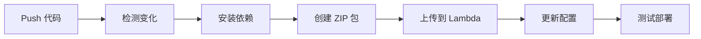
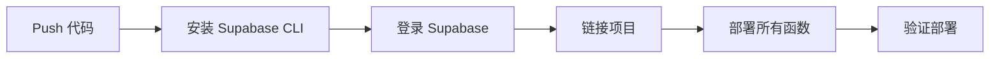

# 后端代码 GitHub 自动化部署指南

## 📋 概述

本指南说明如何使用 GitHub Actions 实现 AWS Lambda 和 Supabase Edge Functions 的自动化部署。

## 🎯 优势

### 手动部署 vs 自动化部署对比

| 特性 | 手动部署 | GitHub Actions 自动部署 |
|------|---------|------------------------|
| **部署触发** | 手动运行命令 | Git push 自动触发 |
| **版本追踪** | 需要手动记录 | 自动关联 Git commit |
| **回滚** | 困难，需要找到旧代码 | 简单，revert commit 即可 |
| **测试** | 手动测试 | 自动化测试 |
| **环境变量** | 需要手动更新 | 统一在 GitHub Secrets 管理 |
| **团队协作** | 需要共享 AWS 凭证 | 只需 Git 权限 |
| **部署历史** | 无记录 | GitHub Actions 完整日志 |

## 🛠 配置步骤

### 1. 设置 GitHub Secrets

在 GitHub 仓库设置中添加以下 Secrets：

#### AWS Lambda 所需的 Secrets：

```
AWS_ACCESS_KEY_ID          # AWS 访问密钥
AWS_SECRET_ACCESS_KEY      # AWS 密钥
AWS_REGION                 # ap-northeast-1
CLERK_SECRET_KEY           # Clerk 认证密钥
VIDEO_BUCKET_NAME          # S3 视频桶名称
YOUTUBE_API_KEY            # YouTube API 密钥（如需要）
```

#### Supabase Edge Functions 所需的 Secrets：

```
SUPABASE_ACCESS_TOKEN      # Supabase 访问令牌
SUPABASE_PROJECT_REF       # Supabase 项目引用 ID
```

### 2. 获取 Supabase Access Token

```bash
# 本地登录 Supabase
supabase login

# 生成访问令牌
supabase access-tokens create "GitHub Actions Deploy"

# 复制生成的 token 添加到 GitHub Secrets
```

### 3. 获取 Supabase Project Ref

```bash
# 在 Supabase 项目设置中找到
# 或使用命令行
supabase projects list
```

## 📁 项目结构

```
my-projects/
├── .github/
│   └── workflows/
│       ├── deploy.yml              # 前端部署
│       ├── deploy-lambda.yml       # Lambda 部署（新增）
│       └── deploy-supabase.yml     # Supabase 部署（新增）
├── backend/
│   ├── lambda-video-management/    # Lambda 函数
│   ├── lambda-user-management/     # Lambda 函数
│   └── supabase/
│       └── functions/              # Edge Functions
│           ├── function1/
│           └── function2/
└── lambda-subtitle/                # 字幕 Lambda 函数
```

## 🚀 使用方法

### 自动部署（推荐）

1. **修改代码**：
   ```bash
   cd backend/lambda-video-management
   # 修改 index.mjs 或其他文件
   ```

2. **提交并推送**：
   ```bash
   git add .
   git commit -m "feat: Add new video processing feature"
   git push
   ```

3. **自动触发**：
   - GitHub Actions 自动检测变化
   - 自动构建和部署
   - 查看进度：https://github.com/damonxuda/my-projects/actions

### 手动触发部署

在 GitHub 网站上：
1. 进入 Actions 标签
2. 选择 "Deploy Lambda Functions" 或 "Deploy Supabase Edge Functions"
3. 点击 "Run workflow"
4. 选择分支并运行

或使用 GitHub CLI：
```bash
gh workflow run deploy-lambda.yml
```

## 🔍 部署流程详解

### AWS Lambda 部署流程



1. **代码变化检测**：只部署修改的 Lambda 函数
2. **依赖安装**：`npm ci` 安装确定版本的依赖
3. **打包**：创建包含代码和 node_modules 的 ZIP
4. **部署**：使用 `aws lambda update-function-code`
5. **配置更新**：更新环境变量（如需要）
6. **验证**：调用健康检查端点

### Supabase Edge Functions 部署流程



## 📊 监控部署

### 查看部署日志

1. 访问：https://github.com/damonxuda/my-projects/actions
2. 点击最近的 workflow 运行
3. 查看详细日志

### 部署状态

- ✅ 绿色勾：部署成功
- ❌ 红色叉：部署失败
- 🟡 黄色点：正在运行

### 部署失败处理

1. **查看错误日志**：
   - 点击失败的 workflow
   - 查看具体步骤的错误信息

2. **常见问题**：
   - **AWS 权限错误**：检查 AWS Secrets 是否正确
   - **依赖安装失败**：检查 package.json
   - **Lambda 更新失败**：检查函数名称是否正确
   - **Supabase 登录失败**：检查 Access Token

## 🎯 最佳实践

### 1. 分支策略

```bash
# 开发分支
git checkout -b feature/new-feature

# 开发和测试
# ...修改代码...
git commit -m "feat: Add new feature"

# 推送到开发分支（不会触发生产部署）
git push origin feature/new-feature

# PR 合并到 main 后自动部署到生产
```

### 2. 环境变量管理

**不要**在代码中硬编码敏感信息：
```javascript
// ❌ 错误
const API_KEY = "sk-xxxxxxxxxxxxx";

// ✅ 正确
const API_KEY = process.env.API_KEY;
```

### 3. 版本标签

重要部署后打标签：
```bash
git tag -a v1.2.3 -m "Release version 1.2.3: Add subtitle feature"
git push origin v1.2.3
```

### 4. 回滚策略

如果部署出现问题：

**方法 1：Revert Commit**
```bash
git revert HEAD
git push
# 自动触发回滚部署
```

**方法 2：手动回滚（AWS Lambda）**
```bash
# Lambda 保留之前的版本
aws lambda update-function-code \
  --function-name FUNCTION_NAME \
  --s3-bucket my-bucket \
  --s3-key old-version.zip
```

## 📝 Lambda 函数名称映射

确保 workflow 中的函数名称与实际 Lambda 函数名称一致：

| 代码位置 | Lambda 函数名 | 用途 |
|---------|--------------|------|
| `backend/lambda-video-management` | `FILE_MANAGEMENT_LAMBDA` | 文件管理 |
| `backend/lambda-user-management` | `USER_MANAGEMENT_LAMBDA` | 用户管理 |
| `lambda-subtitle` | `SUBTITLE_MANAGER_LAMBDA` | 字幕管理 |

## 🔐 安全建议

1. **定期轮换 Secrets**：每 90 天更新一次 AWS 密钥和令牌
2. **最小权限原则**：AWS IAM 用户只授予必要的 Lambda 更新权限
3. **审计日志**：定期查看 GitHub Actions 日志
4. **分支保护**：启用 main 分支保护，需要 PR 审核

## 📚 相关文档

- [GitHub Actions 文档](https://docs.github.com/en/actions)
- [AWS Lambda 部署](https://docs.aws.amazon.com/lambda/)
- [Supabase CLI 文档](https://supabase.com/docs/guides/cli)

## 🆘 故障排除

### Lambda 部署失败

**问题**：`ResourceNotFoundException: Function not found`

**解决**：
1. 检查函数名称是否正确
2. 确认 AWS Region 设置正确
3. 验证 AWS 凭证有权限访问该函数

### Supabase 部署失败

**问题**：`Failed to link project`

**解决**：
1. 确认 SUPABASE_PROJECT_REF 正确
2. 检查 Access Token 是否有效
3. 验证项目是否存在

### ZIP 文件过大

**问题**：`RequestEntityTooLargeException: Request must be smaller than 69905067 bytes`

**解决**：
```bash
# 使用 S3 上传大文件
aws s3 cp lambda-deployment.zip s3://my-deploy-bucket/
aws lambda update-function-code \
  --function-name FUNCTION_NAME \
  --s3-bucket my-deploy-bucket \
  --s3-key lambda-deployment.zip
```

## ✅ 快速检查清单

部署前确认：

- [ ] 所有 GitHub Secrets 已配置
- [ ] Lambda 函数名称正确
- [ ] 代码通过本地测试
- [ ] package.json 依赖版本正确
- [ ] 环境变量已更新
- [ ] 分支保护规则已设置

---

**现在您的后端代码已经实现完整的 GitHub 版本管理和自动化部署！** 🎉
